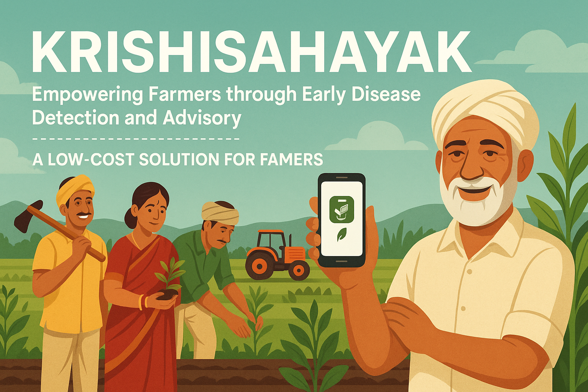

# KrishiSahayak – AI-Powered Crop Health Assistant
स्वस्थ फसल, समृद्ध किसान | Healthy Crops, Prosperous Farmers

<p align="center">
  
</p>

## 🤖 About the Project

KrishiSahayak is an **AI-powered plant disease detection system** that leverages **Deep Learning** and **Computer Vision** to help farmers identify crop diseases early and accurately. Built with **PyTorch** and **Gradio**, it provides an intuitive interface for real-time disease classification with explainable AI visualizations.

### Core AI/ML Technologies

- **Deep Learning Model**: Utilizes a fine-tuned **MobileNetV3 Large** architecture for efficient and accurate disease classification
- **Computer Vision**: Processes plant leaf images to detect visual patterns and symptoms of diseases
- **Explainable AI (XAI)**: Implements **Grad-CAM** visualizations to highlight disease-affected areas in the input images
- **Transfer Learning**: Leverages pre-trained weights from ImageNet for improved performance with limited training data
- **Model Optimization**: Supports model export to ONNX format for efficient deployment

### Key Features

- 🌍 **Multilingual Support**: Available in English, Hindi, and Marathi
- 🔍 **Disease Classification**: Identifies 38 different plant diseases across multiple crops
- 📊 **Confidence Scores**: Provides prediction confidence levels for better decision making
- 🖼️ **Visual Explanations**: Highlights affected areas using heatmap visualizations
- 📱 **Web Interface**: User-friendly Gradio-based web application
- 📊 **Performance Metrics**: Tracks model performance with comprehensive metrics (accuracy, F1-score, precision, recall)
- 🔄 **Model Export**: Export trained models in PyTorch (.pth) and ONNX formats for deployment
- 📈 **Experiment Tracking**: Optional integration with Weights & Biases for experiment tracking

## Getting Started

1. **Clone the Repository**
   ```bash
   git clone https://github.com/VIKAS9793/KrishiSahayak.git
   cd KrishiSahayak
   ```

## Project Overview

KrishiRakshak is a comprehensive AI solution that combines real-time plant disease classification with actionable agricultural advisory. Our system is designed to help rural farmers quickly identify and manage plant diseases through:

### Key Features

1. **Explainable AI with Grad-CAM**
   - Visual heatmaps showing which parts of the leaf the model is focusing on
   - Helps build trust with farmers by making AI decisions interpretable
   - Integrated directly into the prediction interface

2. **Multilingual Support**
   - Currently supports English, Hindi (हिंदी), and Marathi (मराठी)
   - Simple language selector in the UI
   - All predictions and interface elements are translated
   - Easy to add more languages by updating the translations file

3. **User-Friendly Interface**
   - Simple drag-and-drop image upload
   - Side-by-side comparison of original and heatmap views
   - Mobile-responsive design for field use
   - Works offline once the model is downloaded

4. **Technical Highlights**
   - Built with PyTorch and PyTorch Lightning
   - MobileNetV3 Large architecture for efficient inference
   - Optimized for both CPU and GPU
   - Model export to PyTorch and ONNX formats
   - Experiment tracking with Weights & Biases

## Quick Start

For detailed setup and usage instructions, please see our [Quick Start Guide](docs/QUICKSTART.md).

## Project Overview

KrishiRakshak is a comprehensive AI solution that combines real-time plant disease classification with actionable agricultural advisory. Our system is designed to help rural farmers quickly identify and manage plant diseases through:

---

### 📖 Read Our Journey
Curious about the story and purpose behind KrishiSahayak? [Read the journey behind KrishiSahayak](docs/journey.md) to learn how and why this project was built, directly from the creator.

---

### Key Features
1. **Real-Time Disease Detection**
   - AI-powered disease identification
   - Offline operation in remote areas
   - Accurate classification of 38 plant diseases

2. **Actionable Advisory System**
   - Immediate disease management recommendations
   - Local language support for better understanding
   - Clear treatment guidelines
   - Emergency response protocols

3. **Resource-Efficient Technology**
   - Optimized MobileNetV3-Large architecture
   - Offline-first deployment
   - Efficient model quantization
   - Multi-format export for various devices

### Core Capabilities
- Real-time disease detection
- Actionable advisory recommendations
- Offline-capable operation
- Multi-language support
- Explainable predictions
- Resource-efficient design

### Project Vision
To empower rural farmers with accurate, accessible, and explainable AI-powered crop health monitoring tools that help prevent crop losses and improve agricultural productivity through immediate advisory support.

### Technical Mission
- Provide accurate disease detection
- Maintain model accuracy on low-resource devices
- Enable offline operation in remote areas
- Support multiple languages for better accessibility
- Generate actionable recommendations

## Data Sources & Rationale

KrishiSahayak uses two primary, open-access datasets for robust and generalizable plant disease detection:

- **PlantVillage** ([Kaggle](https://www.kaggle.com/datasets/abdallahalidev/plantvillage-dataset), [figshare](https://doi.org/10.6084/m9.figshare.15124244.v1))
  - The largest, most widely used open-source plant disease image dataset, covering 38+ classes across multiple crops and disease types.
  - License: Creative Commons Attribution 4.0 International (CC BY 4.0)
  - Citation: A. Prabhu, A. Singh, M. Singh, and A. Singh, "PlantVillage Dataset - Leaf Images with Disease Information", figshare, 2020.

- **PlantDoc** ([GitHub](https://github.com/pratikkayal/PlantDoc-Dataset), [Paper](https://arxiv.org/abs/2001.05954))
  - A real-world, in-field plant disease dataset with challenging backgrounds, lighting, and occlusions, complementing PlantVillage's clean images.
  - License: CC BY-NC-SA 4.0
  - Citation: Kayal, P., Chakraborty, S., & Das, K. (2020). PlantDoc: A Dataset for Visual Plant Disease Detection. arXiv:2001.05954.

**Why only these datasets?**
- They offer the best combination of diversity, real-world coverage, open licensing, and benchmarking value for plant disease detection.
- PlantVillage provides balanced, clean data for robust training; PlantDoc introduces real-world variability for generalization.
- Both are widely used in research, enabling comparability and reproducibility.
- The pipeline is extensible for future datasets, but these two provide the strongest foundation for practical, ethical, and legal deployment.

## Documentation

For detailed technical documentation, please refer to:
- [Architecture Guide](docs/ARCHITECTURE.md) - Technical architecture and system design
- [Quick Start Guide](docs/QUICKSTART.md) - Getting started instructions

## Technical Architecture

KrishiSahayak leverages a modern deep learning stack for efficient plant disease classification:

### Model Architecture
- **Backbone**: MobileNetV3-Large (pretrained on ImageNet)
- **Classifier Head**: Custom layers with dropout and ReLU activation
- **Input Size**: 224x224 pixels (RGB)
- **Output**: 38 plant disease classes

### Training Pipeline
1. Data loading and augmentation
2. Model training with mixed precision
3. Validation and metric computation
4. Model checkpointing and logging

### Deployment Options
- ONNX Runtime for CPU/GPU inference
- TensorFlow Lite for mobile deployment
- TorchScript for production serving

## Project Structure

```
KrishiSahayak/
├── README.md                # Project overview, usage, and instructions (should remain top-level)
├── LICENSE                  # License file (top-level standard)
├── requirements.txt         # Python dependencies
├── app.py                   # (Legacy or entry-point script, if still needed)
├── code_reviewer.py         # (Utility or legacy script, if still needed)
│
├── assets/                  # Static assets (e.g., banners, images for UI)
│
├── configs/
│   ├── default.yaml         # Main configuration file
│   └── data/
│       └── merge_config.json (if needed for future merges)
│
├── data/
│   ├── raw/                 # Original, untouched datasets (PlantVillage, PlantDoc, etc.)
│   └── final/
│       └── plant_disease_balanced/  # Cleaned, merged, balanced dataset for training/validation/testing
│
├── docs/
│   ├── ARCHITECTURE.md      # System and code architecture
│   ├── QUICKSTART.md        # Quickstart guide for new users/contributors
│   ├── journey.md           # Project journey, decisions, and rationale
│   └── RENAME_JUSTIFICATION.md # Documentation on file/class renaming
│
├── models/
│   ├── teacher/             # Teacher model checkpoints (e.g., EfficientNetV2)
│   └── student/             # Student/distilled model checkpoints (e.g., MobileNetV3)
│
├── reports/                 # For future data validation, model evaluation, or experiment reports (currently empty)
│
├── scripts/
│   ├── data/                # Data processing, cleaning, merging, and distillation scripts
│   └── export/              # Scripts for exporting models (e.g., to TFLite, ONNX)
│
├── src/
│   ├── config.py            # Centralized configuration for training/augmentation
│   ├── models/              # Model definitions (plant_model.py, etc.)
│   ├── train.py             # Main training script
│   ├── utils/               # Utility modules (advisory, gradcam, translations, etc.)
│   └── web/
│       └── app.py           # Web application backend (Flask/FastAPI/etc.)
│
└── .venv/                   # (If present) Python virtual environment (should be in .gitignore)
```

## Getting Started

### 1. Prerequisites

#### Hardware Requirements

- **CPU**: Minimum 4 cores (8+ recommended)
- **RAM**: Minimum 8GB (16GB+ recommended)
- **Storage**: At least 10GB free space for dataset and models
- **GPU**: Optional but recommended for faster training (NVIDIA GPU with CUDA support)

#### Software Requirements

- Python 3.10 (recommended) or 3.9
- pip (Python package installer)
- CUDA (optional, for GPU acceleration)
  - For GPU support: CUDA 11.8 and compatible drivers
  - For CPU-only: No additional requirements

### 2. Quick Start

```bash
# 1. Clone the repository
git clone https://github.com/VIKAS9793/KrishiSahayak.git
cd KrishiSahayak

# 2. Install dependencies
pip install -r requirements.txt

# 3. Prepare your dataset (see Data Preparation below)
# 4. Start training
python src/train.py
```

### 3. Data Preparation

Ensure your data is in the following structure:

```
data/
├── processed_data/
│   ├── train.csv
│   ├── val.csv
│   └── test.csv
└── plantvillage/
    ├── train/
    │   ├── class1/
    │   └── class2/
    ├── val/
    └── test/
```

### 3. Training

```bash
# Basic training
python src/train.py

# With custom parameters
python src/train.py \
    --model efficientnet_b3 \
    --batch-size 32 \
    --epochs 50 \
    --lr 0.001
```

### 4. Monitoring

Monitor training with TensorBoard:

```bash
tensorboard --logdir=logs/
```

## Key Features

- **Modular Code**: Clean separation of data, model, and training logic
- **Reproducibility**: Full experiment tracking with PyTorch Lightning
- **Efficient Training**: Mixed precision and gradient accumulation
- **Data Augmentation**: Extensive image augmentations with Albumentations
- **Class Imbalance Handling**: Weighted sampling and class weights
- **Model Checkpointing**: Automatic saving of best models
- **Early Stopping**: Prevents overfitting
- **Learning Rate Scheduling**: Cosine annealing with warm restarts

## Model Architecture

- **Backbone**: EfficientNet-B3 (pretrained on ImageNet)
- **Classifier**: Custom head with dropout
- **Loss**: Cross-Entropy with class weights
- **Optimizer**: AdamW with weight decay
- **Scheduler**: Cosine Annealing with warm restarts

## Performance

Monitor training progress using TensorBoard. Key metrics include:

- Training/Validation Loss
- Accuracy
- F1 Score
- Precision
- Recall

## License

This project is licensed under the MIT License - see the [LICENSE](LICENSE) file for details.

## Model Roles: Teacher vs. Student

- **Teacher Model (EfficientNetV2):**
  - Used for high-accuracy training and as the source of knowledge in the distillation process.
  - Stored in `models/teacher/`.
  - Not intended for direct deployment on resource-constrained devices due to its size and computational requirements.

- **Student Model (MobileNetV3 Large):**
  - Lightweight, efficient model distilled from the teacher.
  - Used for real-time inference on web, mobile, and edge devices.
  - Stored in `models/student/`.
  - Optimized for speed and low resource usage while maintaining high accuracy.

This setup ensures you get the best of both worlds: high-accuracy training and practical, fast deployment.
