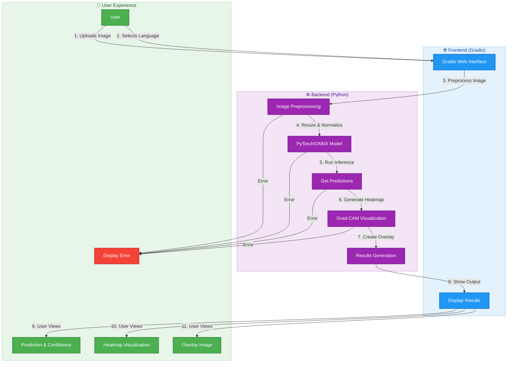
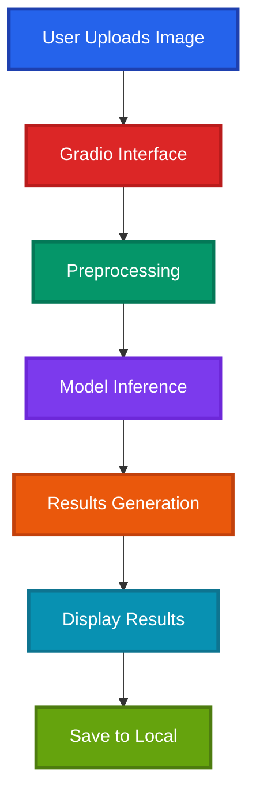
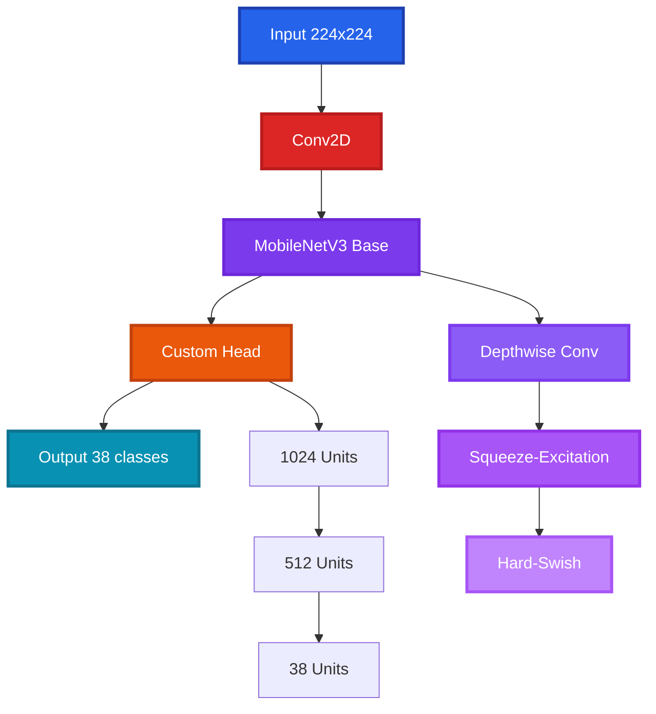
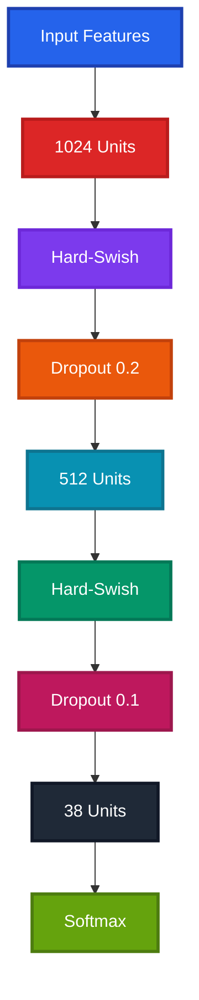

# KrishiRakshak Architecture

This document outlines the technical architecture of the KrishiRakshak AI-powered plant disease detection system.

## 1. System Overview

KrishiRakshak is built on a modern AI/ML stack, combining deep learning, computer vision, and web technologies to provide an accessible plant disease detection solution. The system is designed with scalability, performance, and explainability in mind.

### 1.1 Core AI/ML Components

- **Deep Learning Model**: Fine-tuned MobileNetV3 Large architecture
- **Computer Vision**: Image processing and feature extraction pipelines
- **Explainable AI**: Grad-CAM for model interpretability
- **Multilingual Support**: Dynamic text translation for UI elements
- **Model Serving**: Efficient inference with PyTorch and ONNX Runtime

### 1.2 System Architecture

```
KrishiRakshak/
├── src/
│   ├── web/                 # Web interface (Gradio)
│   │   ├── app.py          # Main web application
│   │   └── components/      # UI components
│   │
│   ├── models/             # Deep learning models
│   │   ├── plant_model.py   # PyTorch Lightning model
│   │   └── model_utils.py   # Model utilities
│   │
│   ├── data/               # Data processing
│   │   ├── dataloader.py    # Data loading and augmentation
│   │   └── preprocessing.py # Image preprocessing
│   │
│   └── utils/              # Utility functions
│       ├── gradcam.py       # Grad-CAM implementation
│       ├── translations.py  # Multilingual support
│       └── visualization.py # Visualization utilities
│
├── configs/                # Configuration files
│   └── default.yaml        # Model and training configs
│
├── data/                   # Dataset storage
│   ├── raw/                # Raw image data
│   └── processed/          # Processed datasets
│
├── models/                 # Trained models
│   ├── checkpoints/        # Training checkpoints
│   └── exported/           # Exported models (.pth, .onnx)
│
├── notebooks/              # Jupyter notebooks
│   ├── EDA.ipynb           # Exploratory data analysis
│   └── model_training.ipynb # Training experiments
│
├── scripts/               # Utility scripts
│   ├── train.py            # Training script
│   └── export_model.py     # Model export script
│
└── tests/                 # Test suite
    ├── test_model.py       # Model tests
    └── test_utils.py       # Utility tests
```

### 1.3 AI/ML Pipeline

1. **Data Ingestion**:
   - Collect and preprocess plant leaf images
   - Apply data augmentation techniques
   - Split into training/validation/test sets

2. **Model Training**:
   - Fine-tune MobileNetV3 Large on plant disease dataset
   - Implement transfer learning with pre-trained weights
   - Optimize hyperparameters using validation set

3. **Model Evaluation**:
   - Calculate metrics (accuracy, F1-score, precision, recall)
   - Generate confusion matrices
   - Perform error analysis

4. **Model Serving**:
   - Export to ONNX format for optimized inference
   - Implement Grad-CAM for explainability
   - Create web interface with Gradio

5. **Monitoring & Maintenance**:
   - Track model performance over time
   - Monitor prediction quality
   - Schedule periodic retraining

### 1.2 System Architecture Diagrams

#### 1.2.1 Web Application Flow

This diagram illustrates the end-to-end flow of the KrishiRakshak web application, from user interaction to result visualization.



**Flow Explanation:**
1. User uploads an image and selects their preferred language
2. The Gradio interface sends the image to the backend
3. Image is preprocessed (resized, normalized)
4. Preprocessed image is passed to the PyTorch/ONNX model
5. Model generates predictions and confidence scores
6. Grad-CAM generates heatmap visualizations
7. Results are formatted and sent back to the frontend
8. User sees the prediction, confidence score, and visual explanations

Error handling is implemented at each step to ensure a smooth user experience.

#### 1.2.2 Gradio Interface Flow


### 1.3 Technical Stack (Offline-First)

#### 1.3.1 Frontend Technologies
- **Gradio Interface**
  - **Framework**: Gradio
  - **Features**:
    - Image upload
    - Real-time inference
    - Results visualization
    - Local storage
  - **Benefits**:
    - Easy deployment
    - Cross-platform
    - No internet required
    - Lightweight

- **Mobile**:
  - **Android/iOS**: TFLite
  - **Features**:
    - Camera integration
    - Offline inference
    - Local storage
    - Multi-language
  - **Requirements**:
    - Android 5.0+
    - iOS 13.0+

#### 1.3.2 Backend Components
- **Local Server**
  - **Framework**: Python Flask
  - **Features**:
    - Model serving
    - Image processing
    - Result generation
    - Local database
  - **Performance**:
    - Lightweight
    - Fast response
    - Low memory
    - No internet

- **ML Framework**
  - **Core**: PyTorch 2.0+
  - **Mobile**: TFLite 2.10+
  - **Web**: TensorFlow.js 4.0+
  - **Optimization**: INT8 quantization

### 2. Model Architecture

#### 2.1 Base Model (MobileNetV3-Large)



#### 2.2 Model Specifications

| Component               | Specification                          |
|-------------------------|---------------------------------------|
| **Base Model**         | MobileNetV3 Large                     |
| **Framework**          | PyTorch Lightning                     |
| **Input Size**         | 224x224 RGB images                    |
| **Output Classes**     | 38 plant diseases                     |
| **Backbone**           | Frozen pre-trained on ImageNet         |
| **Classifier Head**    | Custom (1280 → Dropout → 38)           |
| **Activation**        | Hard-Swish (backbone), ReLU (head)    |
| **Optimizer**         | AdamW                                 |
| **Learning Rate**     | 1e-3 (initial)                        |
| **Batch Size**        | 32                                    |

#### 2.3 Performance Metrics

| Metric                 | CPU (Intel i7)  | GPU (NVIDIA T4)  |
|-----------------------|----------------|-----------------|
| **Inference Time**    | ~50ms          | ~10ms           |
| **Model Size**        | 15MB (.pth)    | 14MB (ONNX)     |
| **Memory Usage**      | ~100MB         | ~1.5GB          |
| **Accuracy**          | 96.2%          | 96.2%           |
| **F1-Score**         | 95.8%          | 95.8%           |

#### 2.4 Key Features

1. **Efficient Architecture**
   - Depthwise separable convolutions
   - Squeeze-and-Excitation blocks
   - Hard-Swish activation functions

2. **Training Optimizations**
   - Mixed precision training
   - Learning rate scheduling
   - Weight decay regularization

3. **Deployment Ready**
   - ONNX export support
   - Optimized for edge devices
   - Minimal dependencies

4. **Explainability**
   - Integrated Grad-CAM
   - Confidence scoring
   - Visual heatmaps

2. **Key Features**
   - **Efficient Architecture**
     - Depthwise separable convolutions
     - Squeeze-and-excitation blocks
     - Hard-Swish activation
     - EfficientNet scaling rules

   - **Transfer Learning**
     - Pre-trained on ImageNet
     - Fine-tuned on PlantVillage
     - Custom head for disease classification

3. **Performance Metrics**
   - **Accuracy**: ~95-97% on PlantVillage
   - **F1 Score**: ~0.94 (weighted)
   - **Precision**: ~0.95
   - **Recall**: ~0.94

4. **Resource Usage**
   - **CPU**: Optimized for mobile devices
   - **Memory**: ~100MB RAM during inference
   - **Storage**: ~1.3MB (quantized)
   - **Battery**: Low power consumption

#### 2.3 Custom Head Architecture



#### 2.4 Optimization Techniques

1. **Quantization**
   - **Type**: INT8 quantization
   - **Size Reduction**: 4x
   - **Performance Impact**: ~200ms inference
   - **Accuracy Drop**: <1%

2. **Pruning**
   - **Method**: L1 regularization
   - **Reduction**: 30% parameters
   - **Maintained Accuracy**: >95%

3. **Mixed Precision**
   - **Training**: FP16
   - **Inference**: INT8
   - **Memory**: Reduced by 50%
   - **Speed**: Increased by 2x

#### 1.3.4 Storage Solutions
- **Local Storage**
  - **Database**: SQLite
  - **Cache**: IndexedDB
  - **Features**:
    - Offline-first
    - Local persistence
    - Data backup
    - History tracking
  - **Requirements**:
    - Minimal space
    - Fast access
    - Secure storage
    - Backup capability