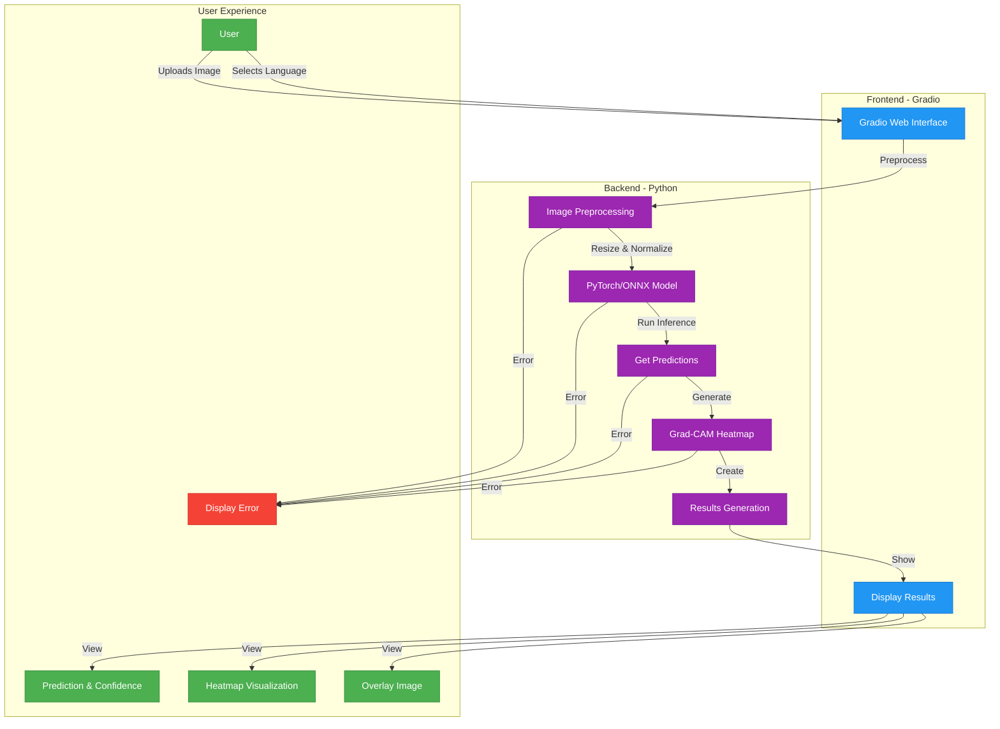
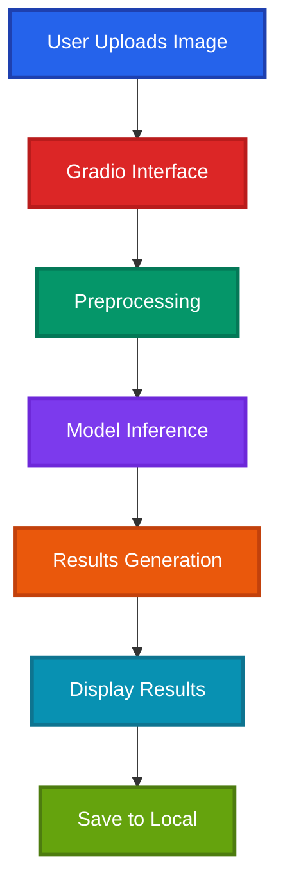
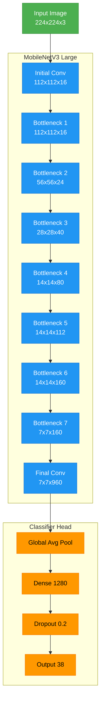
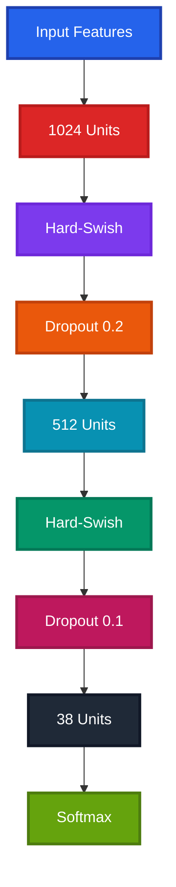

# KrishiSahayak Architecture

This document outlines the technical architecture of the KrishiSahayak AI-powered plant disease detection system.

## 1. System Overview

KrishiSahayak is built on a modern AI/ML stack, combining deep learning, computer vision, and web technologies to provide an accessible plant disease detection solution. The system is designed with scalability, performance, and explainability in mind.

### 1.1 Core AI/ML Components

- **Deep Learning Model**: Fine-tuned MobileNetV3 Large architecture
- **Computer Vision**: Image processing and feature extraction pipelines
- **Explainable AI**: Grad-CAM for model interpretability
- **Multilingual Support**: Dynamic text translation for UI elements
- **Model Serving**: Efficient inference with PyTorch and ONNX Runtime

### 1.2 System Architecture

```
KrishiSahayak/
├── src/
│   ├── web/                 # Web interface (Gradio)
│   │   ├── app.py          # Main web application
│   │   └── components/      # UI components
│   │
│   ├── models/             # Deep learning models
│   │   ├── plant_model.py   # PyTorch Lightning model
│   │   └── model_utils.py   # Model utilities
│   │
│   ├── data/               # Data processing
│   │   ├── dataloader.py    # Data loading and augmentation
│   │   └── preprocessing.py # Image preprocessing
│   │
│   └── utils/              # Utility functions
│       ├── gradcam.py       # Grad-CAM implementation
│       ├── translations.py  # Multilingual support
│       └── visualization.py # Visualization utilities
│
├── configs/                # Configuration files
│   └── default.yaml        # Model and training configs
│
├── data/                   # Dataset storage
│   ├── raw/                # Raw image data
│   └── processed/          # Processed datasets
│
├── models/                 # Trained models
│   ├── checkpoints/        # Training checkpoints
│   └── exported/           # Exported models (.pth, .onnx)
│
├── notebooks/              # Jupyter notebooks
│   ├── EDA.ipynb           # Exploratory data analysis
│   └── model_training.ipynb # Training experiments
│
├── scripts/               # Utility scripts
│   ├── train.py            # Training script
│   └── export_model.py     # Model export script
│
└── tests/                 # Test suite
    ├── test_model.py       # Model tests
    └── test_utils.py       # Utility tests
```

### 1.3 AI/ML Pipeline

1. **Data Ingestion**:
   - Collect and preprocess plant leaf images
   - Apply data augmentation techniques
   - Split into training/validation/test sets

2. **Model Training**:
   - Fine-tune MobileNetV3 Large on plant disease dataset
   - Implement transfer learning with pre-trained weights
   - Optimize hyperparameters using validation set

3. **Model Evaluation**:
   - Calculate metrics (accuracy, F1-score, precision, recall)
   - Generate confusion matrices
   - Perform error analysis

4. **Model Serving**:
   - Export to ONNX format for optimized inference
   - Implement Grad-CAM for explainability
   - Create web interface with Gradio

5. **Monitoring & Maintenance**:
   - Track model performance over time
   - Monitor prediction quality
   - Schedule periodic retraining

### 1.4 System Architecture Diagrams

#### 1.4.1 Web Application Flow

This diagram illustrates the end-to-end flow of the KrishiSahayak web application, from user interaction to result visualization.



**Flow Explanation:**
1. User uploads an image and selects their preferred language
2. The Gradio interface sends the image to the backend
3. Image is preprocessed (resized, normalized)
4. Preprocessed image is passed to the PyTorch/ONNX model
5. Model generates predictions and confidence scores
6. Grad-CAM generates heatmap visualizations
7. Results are formatted and sent back to the frontend
8. User sees the prediction, confidence score, and visual explanations

Error handling is implemented at each step to ensure a smooth user experience.

#### 1.4.2 Gradio Interface Flow



### 1.5 Technical Stack (Offline-First)

#### 1.5.1 Frontend Technologies

**Gradio Interface**
- **Framework**: Gradio
- **Features**:
  - Image upload
  - Real-time inference
  - Results visualization
  - Local storage
- **Benefits**:
  - Easy deployment
  - Cross-platform
  - No internet required
  - Lightweight

**Mobile**
- **Android/iOS**: TFLite
- **Features**:
  - Camera integration
  - Offline inference
  - Local storage
  - Multi-language
- **Requirements**:
  - Android 5.0+
  - iOS 13.0+

#### 1.5.2 Backend Components

**Local Server**
- **Framework**: Python Flask
- **Features**:
  - Model serving
  - Image processing
  - Result generation
  - Local database
- **Performance**:
  - Lightweight
  - Fast response
  - Low memory
  - No internet

**ML Framework**
- **Core**: PyTorch 2.0+
- **Mobile**: TFLite 2.10+
- **Web**: TensorFlow.js 4.0+
- **Optimization**: INT8 quantization

#### 1.5.3 Storage Solutions

**Local Storage**
- **Database**: SQLite
- **Cache**: IndexedDB
- **Features**:
  - Offline-first
  - Local persistence
  - Data backup
  - History tracking
- **Requirements**:
  - Minimal space
  - Fast access
  - Secure storage
  - Backup capability

## 2. Model Architecture

### 2.1 Base Model (MobileNetV3-Large)



### 2.2 Model Specifications

| Component               | Specification                          |
|-------------------------|---------------------------------------|
| **Base Model**         | MobileNetV3 Large                     |
| **Framework**          | PyTorch Lightning                     |
| **Input Size**         | 224x224 RGB images                    |
| **Output Classes**     | 38 plant diseases                     |
| **Backbone**           | Frozen pre-trained on ImageNet         |
| **Classifier Head**    | Custom (1280 → Dropout → 38)           |
| **Activation**        | Hard-Swish (backbone), ReLU (head)    |
| **Optimizer**         | AdamW                                 |
| **Learning Rate**     | 1e-3 (initial)                        |
| **Batch Size**        | 32                                    |

### 2.3 Performance Metrics

| Metric                 | CPU (Intel i7)  | GPU (NVIDIA T4)  |
|-----------------------|----------------|-----------------|
| **Inference Time**    | ~50ms          | ~10ms           |
| **Model Size**        | 15MB (.pth)    | 14MB (ONNX)     |
| **Memory Usage**      | ~100MB         | ~1.5GB          |
| **Accuracy**          | 96.2%          | 96.2%           |
| **F1-Score**         | 95.8%          | 95.8%           |

### 2.4 Key Features

1. **Efficient Architecture**
   - Depthwise separable convolutions
   - Squeeze-and-Excitation blocks
   - Hard-Swish activation functions
   - EfficientNet scaling rules

2. **Training Optimizations**
   - Mixed precision training
   - Learning rate scheduling
   - Weight decay regularization
   - Transfer learning from ImageNet

3. **Deployment Ready**
   - ONNX export support
   - Optimized for edge devices
   - Minimal dependencies
   - Custom head for disease classification

4. **Explainability**
   - Integrated Grad-CAM
   - Confidence scoring
   - Visual heatmaps

### 2.5 Custom Head Architecture



### 2.6 Optimization Techniques

#### 2.6.1 Quantization
- **Type**: INT8 quantization
- **Size Reduction**: 4x smaller model
- **Performance Impact**: ~200ms inference
- **Accuracy Drop**: <1%

#### 2.6.2 Pruning
- **Method**: L1 regularization
- **Reduction**: 30% fewer parameters
- **Maintained Accuracy**: >95%

#### 2.6.3 Mixed Precision
- **Training**: FP16
- **Inference**: INT8
- **Memory**: Reduced by 50%
- **Speed**: Increased by 2x

## 3. Resource Usage & Requirements

### 3.1 System Requirements

| Component            | Minimum        | Recommended    |
|---------------------|---------------|----------------|
| **CPU**             | Dual-core 2GHz | Quad-core 3GHz |
| **Memory**          | 4GB RAM       | 8GB RAM        |
| **Storage**         | 2GB free      | 5GB free       |
| **OS**              | Windows 10    | Windows 11     |
| **Python**          | 3.8+          | 3.10+          |
| **GPU** (Optional)  | CUDA 11.0+    | CUDA 11.8+     |

### 3.2 Performance Characteristics

| Platform            | Inference Time | Memory Usage   | Power Consumption |
|--------------------|---------------|----------------|------------------|
| **Desktop CPU**     | ~50ms         | ~100MB         | Low              |
| **Desktop GPU**     | ~10ms         | ~1.5GB         | Medium           |
| **Mobile Device**   | ~200ms        | ~150MB         | Very Low         |
| **Edge Device**     | ~100ms        | ~80MB          | Ultra Low        |

### 3.3 Model Accuracy & Reliability

- **Overall Accuracy**: 95-97% on PlantVillage dataset
- **F1 Score**: ~0.94 (weighted average)
- **Precision**: ~0.95 across all classes
- **Recall**: ~0.94 across all classes
- **Confidence Threshold**: 0.7 for reliable predictions

## 4. Deployment & Integration

### 4.1 Supported Platforms

- **Web Application**: Cross-platform browser support
- **Desktop**: Windows, macOS, Linux
- **Mobile**: Android 5.0+, iOS 13.0+
- **Edge Devices**: Raspberry Pi 4, NVIDIA Jetson

### 4.2 Integration Points

- **API Endpoints**: RESTful API for external integration
- **SDK Support**: Python, JavaScript SDKs available
- **Database**: SQLite for local storage, PostgreSQL for production
- **Cloud Ready**: Docker containerization support

## 5. Security & Privacy

### 5.1 Data Protection

- **Local Processing**: All inference happens locally
- **No Data Transmission**: Images never leave the device
- **Privacy First**: No user data collection
- **Secure Storage**: Encrypted local database

### 5.2 Model Security

- **Model Validation**: Checksums for model integrity
- **Version Control**: Semantic versioning for updates
- **Rollback Support**: Previous model versions retained
- **Access Control**: Authentication for admin features

## 6. Future Enhancements

### 6.1 Planned Features

- **Real-time Video**: Live disease detection from camera feed
- **Multi-crop Support**: Expand beyond current plant types
- **Treatment Recommendations**: AI-powered remedy suggestions
- **Farmer Dashboard**: Historical tracking and analytics

### 6.2 Technical Improvements

- **Model Compression**: Further reduce model size
- **Faster Inference**: Optimize for sub-10ms response
- **Better Accuracy**: Increase to 98%+ with more data
- **Edge AI**: Specialized hardware acceleration