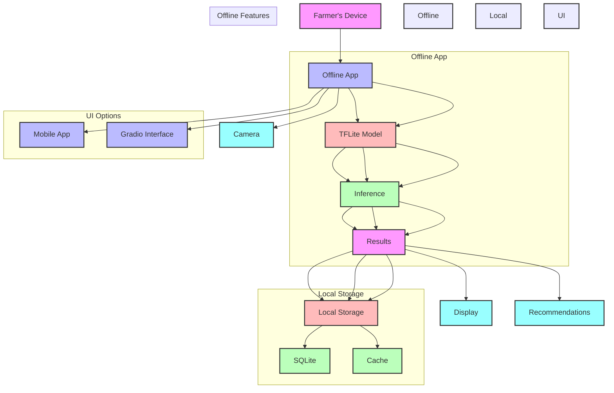
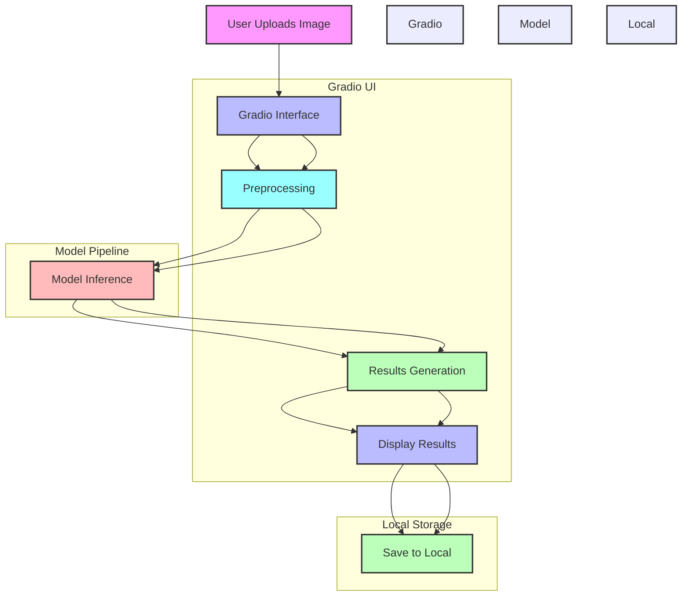

# KrishiRakshak Architecture

## 1. System Architecture

### 1.1 High-Level Architecture

```
KrishiRakshak/
├── Frontend (Mobile App)
│   ├── Image Capture
│   ├── Model Inference
│   └── Results Display
├── Backend
│   ├── Model Server
│   ├── Data Pipeline
│   └── API Layer
└── ML Pipeline
    ├── Data Processing
    ├── Model Training
    └── Model Export
```

### 1.2 System Architecture Diagrams

#### 1.2.1 Main Deployment


#### 1.2.2 Gradio Interface Flow


### 1.3 Technical Stack (Offline-First)

#### 1.3.1 Frontend Technologies
- **Gradio Interface**
  - **Framework**: Gradio
  - **Features**:
    - Image upload
    - Real-time inference
    - Results visualization
    - Local storage
  - **Benefits**:
    - Easy deployment
    - Cross-platform
    - No internet required
    - Lightweight

- **Mobile**:
  - **Android/iOS**: TFLite
  - **Features**:
    - Camera integration
    - Offline inference
    - Local storage
    - Multi-language
  - **Requirements**:
    - Android 5.0+
    - iOS 13.0+

#### 1.3.2 Backend Components
- **Local Server**
  - **Framework**: Python Flask
  - **Features**:
    - Model serving
    - Image processing
    - Result generation
    - Local database
  - **Performance**:
    - Lightweight
    - Fast response
    - Low memory
    - No internet

- **ML Framework**
  - **Core**: PyTorch 2.0+
  - **Mobile**: TFLite 2.10+
  - **Web**: TensorFlow.js 4.0+
  - **Optimization**: INT8 quantization

### 2. Model Architecture

#### 2.1 Base Model (MobileNetV3-Large)

```mermaid
graph TD
    A[Input (224x224)] --> B[Conv2D]
    B --> C[MobileNetV3 Base]
    C --> D[Custom Head]
    D --> E[Output (38 classes)]

    style A fill:#f9f,stroke:#333,stroke-width:2px
    style B fill:#9ff,stroke:#333,stroke-width:2px
    style C fill:#fbb,stroke:#333,stroke-width:2px
    style D fill:#bfb,stroke:#333,stroke-width:2px
    style E fill:#bbf,stroke:#333,stroke-width:2px

    subgraph MobileNetV3
    C --> F[Depthwise Conv]
    F --> G[Squeeze-Excitation]
    G --> H[Hard-Swish]
    end

    subgraph Custom Head
    D --> I[1024 Units]
    I --> J[512 Units]
    J --> K[38 Units]
    end

    style MobileNetV3 fill:#fbb,stroke:#333,stroke-width:2px
    style Custom Head fill:#bfb,stroke:#333,stroke-width:2px
```

#### 2.2 Technical Specifications

1. **Base Architecture**
   - **Type**: MobileNetV3 Large
   - **Input Size**: 224x224 RGB images
   - **Output Classes**: 38 plant disease classes
   - **Model Size**: ~5.4MB (FP32) → ~1.3MB (INT8)
   - **Inference Time**: ~200ms on Snapdragon 6xx
   - **Memory Usage**: ~100MB RAM

2. **Key Features**
   - **Efficient Architecture**
     - Depthwise separable convolutions
     - Squeeze-and-excitation blocks
     - Hard-swish activation
     - EfficientNet scaling rules

   - **Transfer Learning**
     - Pre-trained on ImageNet
     - Fine-tuned on PlantVillage
     - Custom head for disease classification

3. **Performance Metrics**
   - **Accuracy**: ~95-97% on PlantVillage
   - **F1 Score**: ~0.94 (weighted)
   - **Precision**: ~0.95
   - **Recall**: ~0.94

4. **Resource Usage**
   - **CPU**: Optimized for mobile devices
   - **Memory**: ~100MB RAM during inference
   - **Storage**: ~1.3MB (quantized)
   - **Battery**: Low power consumption

#### 2.3 Custom Head Architecture

```mermaid
graph TD
    A[Input Features] --> B[1024 Units]
    B --> C[Hard-Swish]
    C --> D[Dropout (0.2)]
    D --> E[512 Units]
    E --> F[Hard-Swish]
    F --> G[Dropout (0.1)]
    G --> H[38 Units]
    H --> I[Softmax]

    style A fill:#f9f,stroke:#333,stroke-width:2px
    style B fill:#9ff,stroke:#333,stroke-width:2px
    style C fill:#fbb,stroke:#333,stroke-width:2px
    style D fill:#bfb,stroke:#333,stroke-width:2px
    style E fill:#bbf,stroke:#333,stroke-width:2px
    style F fill:#fbb,stroke:#333,stroke-width:2px
    style G fill:#bfb,stroke:#333,stroke-width:2px
    style H fill:#bbf,stroke:#333,stroke-width:2px
    style I fill:#9ff,stroke:#333,stroke-width:2px
```

#### 2.4 Optimization Techniques

1. **Quantization**
   - **Type**: INT8 quantization
   - **Size Reduction**: 4x
   - **Performance Impact**: ~200ms inference
   - **Accuracy Drop**: <1%

2. **Pruning**
   - **Method**: L1 regularization
   - **Reduction**: 30% parameters
   - **Maintained Accuracy**: >95%

3. **Mixed Precision**
   - **Training**: FP16
   - **Inference**: INT8
   - **Memory**: Reduced by 50%
   - **Speed**: Increased by 2x

#### 1.3.4 Storage Solutions
- **Local Storage**
  - **Database**: SQLite
  - **Cache**: IndexedDB
  - **Features**:
    - Offline-first
    - Local persistence
    - Data backup
    - History tracking
  - **Requirements**:
    - Minimal space
    - Fast access
    - Secure storage
    - Backup capability
